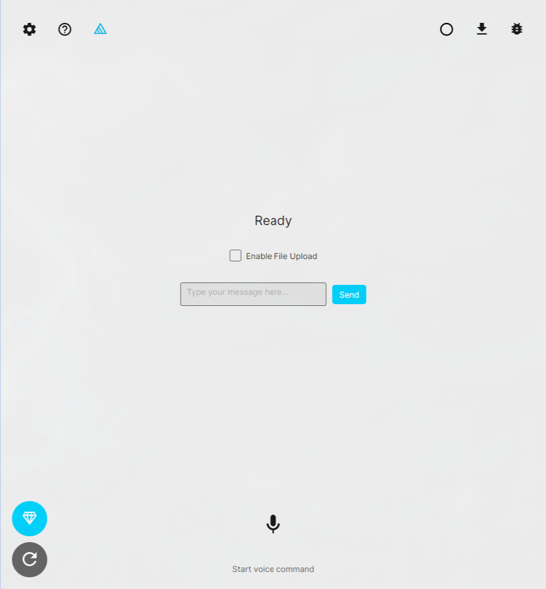
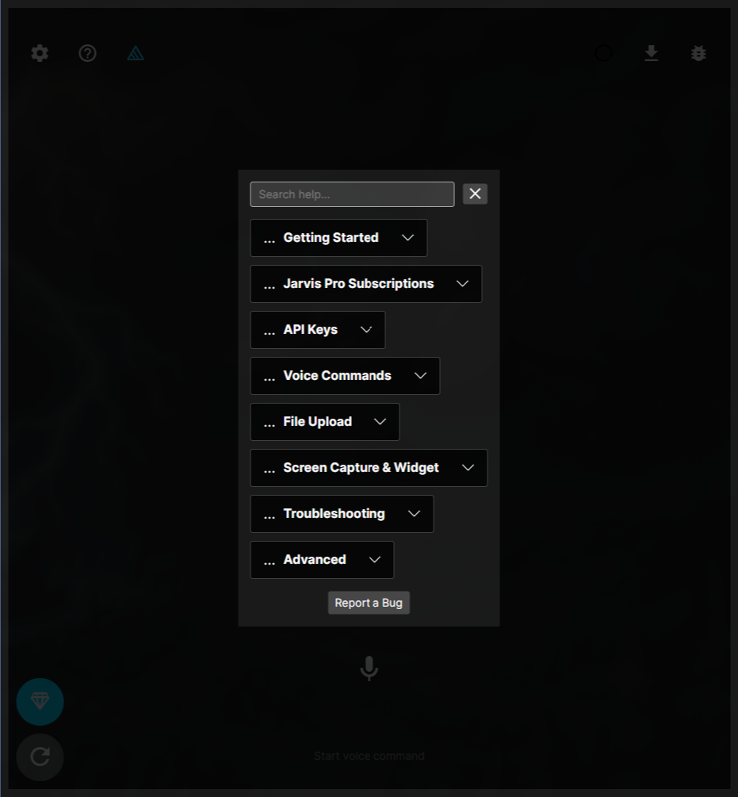

# Jarvis Releases

[](https://github.com/Krzysiek-Mistrz/Jarvis-releases)
[](https://github.com/Krzysiek-Mistrz/Jarvis-releases)
[](https://github.com/Krzysiek-Mistrz/Jarvis-releases)
[](https://github.com/Krzysiek-Mistrz/jarvis_win_android)

Welcome to the official release repository for **Jarvis** – a cross-platform AI voice & text assistant built with **Avalonia UI** *(previously .net MAUI)* and **.NET 10**, running natively on Linux, Windows, and Android.

---

## Application Presentation & Screenshots

### Video Tour
Watch Jarvis in action:

[Watch Jarvis short presentation](materials/short-video-presentation.mp4)

### Screenshots
<p align="center">
  
  
</p>

---

## Features

- **Multi-AI Provider Support**: Talk to Jarvis using Google Gemini, OpenAI, or OpenRouter (DeepSeek) models – bring your own API key or use the free shared key pool.
- **Voice & Text Interaction**: Speak your commands or type them, with platform-native speech recognition and synthesis.
- **File Upload & Analysis**: Attach files for the AI to analyze alongside your request.
- **System Action Execution**: Jarvis can perform actions on your device (opening apps, files, and more), with capabilities scoped to what each platform safely allows.
- **Onboarding & Help**: Built-in interactive tutorial and help system to get you started quickly.
- **Email Bug Reporting**: Report issues directly from within the app.

---

## Installation & Setup

### Linux

> NOTE! #IMPORTANT
> Please make sure that on ur linux distro u install one of these tts services: espeak-ng / espeak / spd-say as jarvis will try 2 use one of these to communicat in speak mode :)

We offer multiple formats to run Jarvis on your favorite Linux distribution:
#### 1. AppImage (Recommended)
The easiest way to run Jarvis on any Linux distribution (Ubuntu, Fedora, Arch, etc.).
1. Download the latest `Jarvis-x86_64.AppImage` from the [Releases](https://github.com/Krzysiek-Mistrz/Jarvis-releases/releases) page.
2. Open your terminal and make the file executable:
```bash
chmod +x Jarvis-x86_64.AppImage
```
3. Run it directly:
```bash
./Jarvis-x86_64.AppImage
```

#### 2. Standard Tarball (.tar.gz)
1. Download the latest `Jarvis-linux-x64.tar.gz` from the Releases page.
2. Extract the archive:
```bash
tar -xzf Jarvis-linux-x64.tar.gz
```
3. Run the executable inside the directory:
```bash
./Jarvis
```

---

### Android
Get Jarvis from the Google Play Store:
[Jarvis on Google Play](https://play.google.com/store/apps/details?id=com.chrisengineer.jarvis&pcampaignid=web_share)

---

### Windows
Get Jarvis from the Microsoft Store:
[Jarvis on Microsoft Store](https://apps.microsoft.com/detail/9pfv17wzr35z?ocid=webpdpshare)

---

## Getting an API Key

Jarvis works out of the box with a free shared API key pool (limited usage), or you can bring your own key for unlimited use:
- **Google Gemini**: https://aistudio.google.com/apikey (free tier available)
- **OpenRouter**: https://openrouter.ai/keys (DeepSeek free tier available)
- **OpenAI**: https://platform.openai.com/api-keys (paid)

---

## Pro Subscription

Upgrade to Pro (one-time payment via Stripe, in-app) for:
- Unlimited shared API key pool access (no daily/hourly limits)
- Ad-free experience
- Support for continued development

---

## Privacy Policy

We take your privacy seriously. API keys are stored locally on your device, files/prompts are sent only to the AI provider you've chosen to process your request, and no conversation data is stored on our servers.

For full details, please refer to our official privacy policy. Please note that the privacy policy is polish. Later it may be converted 2 english: [Privacy Policy (Polityka Prywatności)](https://chrisengineer.ddns.net/archives/strony-glowne/polityka-prywatnosci.php).

---

## Main Repository
The core application project and issue tracker are located in the closed private repo. 
It's closed code as it should be for most apps utilizing their own security-important code (Stripe payments, encryption mechanisms, ...).
